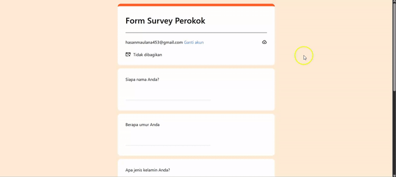

# Survey Form Perokok

Aplikasi form survey sederhana untuk mengumpulkan data responden perokok dengan validasi form dan penyimpanan data ke localStorage.

## Fitur

- ✅ Form survey dengan validasi (React Hook Form + Yup)
- ✅ Custom radio button dan checkbox
- ✅ Conditional rendering (pertanyaan rokok muncul jika perokok)
- ✅ Penyimpanan data ke localStorage
- ✅ Halaman tabel untuk melihat semua submission
- ✅ Alert modal untuk notifikasi
- ✅ Auto redirect setelah submit

## Teknologi

- React
- React Hook Form
- Yup (validasi)
- React Router DOM
- Tailwind CSS
- Lucide React (icons)

### Preview

